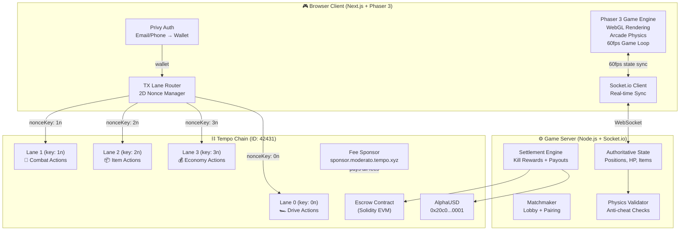
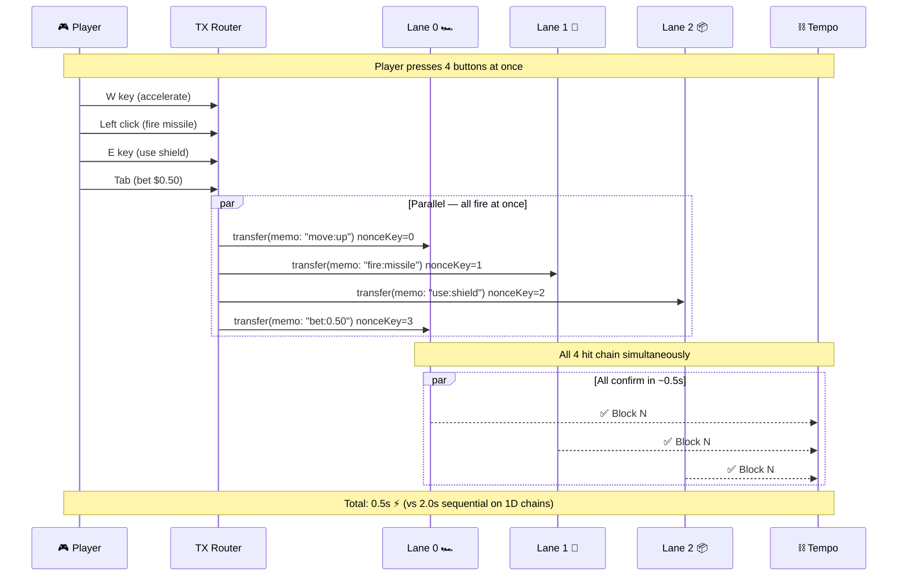
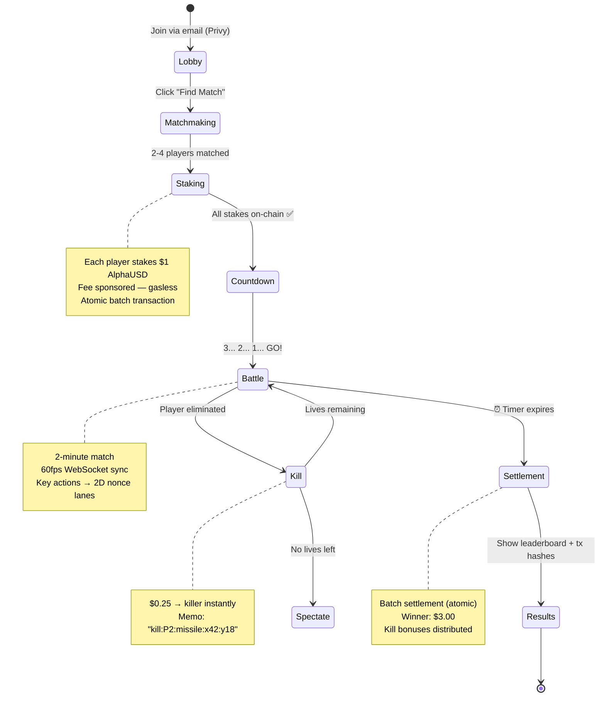
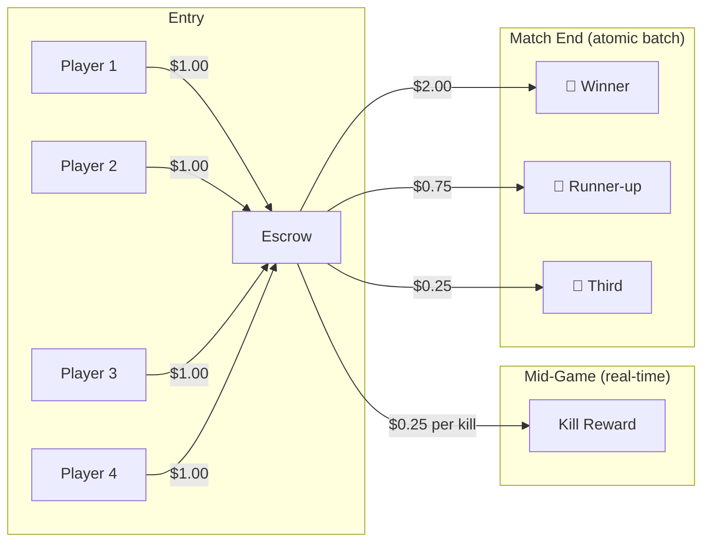
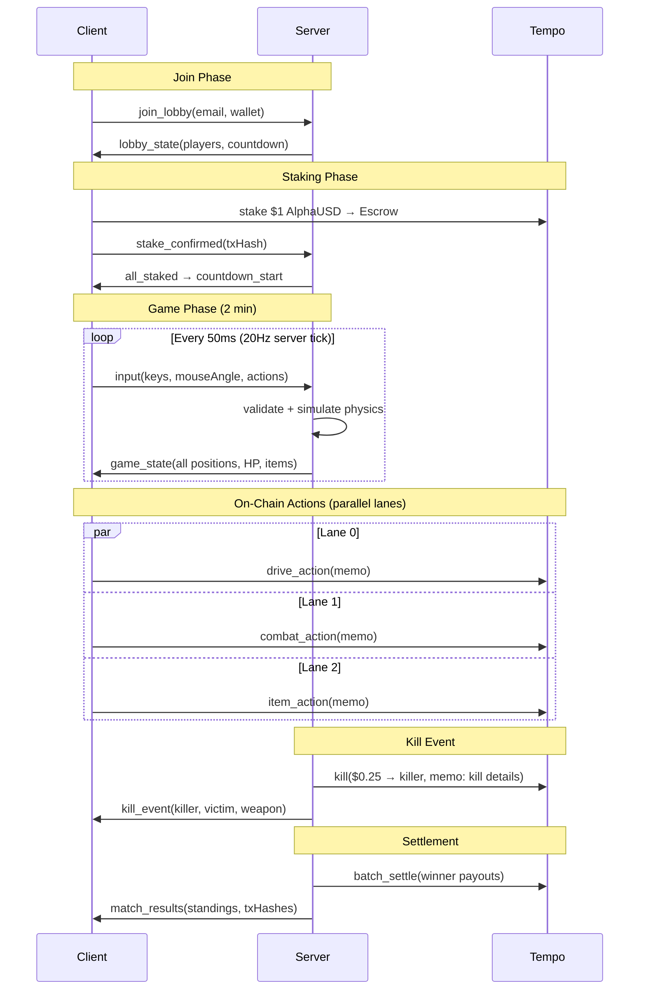

# TEMPO KARTS 🏎️💥

> The first responsive on-chain multiplayer battle racer — powered by Tempo's 2D nonces.

## The Core Innovation

Every on-chain game in history has felt broken because **actions queue sequentially** (1D nonces).
Tempo's **2D nonces** let us create **parallel action lanes** — movement, combat, and items execute simultaneously.

**This is the first on-chain game that actually feels like a game.**

---

## System Architecture



---

## 2D Nonce Action Lanes

The core mechanic that makes this game possible. Each action type uses an independent nonce sequence.



### 1D vs 2D — The Demo Comparison

```mermaid
gantt
    title ❌ 1D Nonces (Ethereum, Solana, etc.)
    dateFormat X
    axisFormat %Ls

    section Player
    Move (nonce 0)           :a1, 0, 500
    BLOCKED ⏳               :crit, a2, 500, 500
    Fire (nonce 1)           :a3, 1000, 500
    BLOCKED ⏳               :crit, a4, 1500, 500
    Use Item (nonce 2)       :a5, 2000, 500
```

```mermaid
gantt
    title ✅ 2D Nonces (Tempo) — Parallel Action Lanes
    dateFormat X
    axisFormat %Ls

    section Lane 0 🏎️
    Move         :a1, 0, 500

    section Lane 1 🔫
    Fire         :b1, 0, 500

    section Lane 2 📦
    Use Item     :c1, 0, 500

    section ⚡
    ALL DONE     :milestone, m1, 500, 0
```





> **1D: 2.5 seconds.  2D: 0.5 seconds.  5× faster.  The game goes from unplayable to buttery.**

---

## Match Lifecycle



---

## Tech Stack

| Layer | Technology | Why |
|-------|-----------|-----|
| **Game Engine** | [Phaser 3](https://phaser.io) (MIT) | Best free 2D engine. WebGL rendering, Arcade Physics, sprites, particles, input handling, tilemaps |
| **Frontend** | Next.js 14 | SSR landing page, API routes, React components for lobby/HUD |
| **Auth** | Privy | Email/phone → wallet. Zero crypto knowledge required |
| **Blockchain** | viem + tempoActions | 2D nonce management, transfers, memos |
| **Multiplayer** | Socket.io | Authoritative server, 60fps state broadcast |
| **Server** | Node.js + Express | Game rooms, physics validation, settlement |
| **Styling** | CSS (dark mode, glassmorphism) | Premium gaming aesthetic |
| **Chain** | Tempo Testnet (42431) | 0.5s blocks, 2D nonces, fee sponsorship, memos |

### Why Phaser 3

- **MIT Licensed** — 100% free, even commercial
- **WebGL + Canvas fallback** — runs everywhere
- **Arcade Physics** — perfect for top-down kart collisions
- **Particle System** — explosions, trails, power-up effects
- **Sprite Sheets** — animated karts, weapons, items
- **Tilemap Support** — arena layouts
- **Input Manager** — keyboard, mouse, touch, gamepad
- **Camera System** — follow player, screen shake on hits
- **10+ years mature** — stable, documented, huge community

---

## On-Chain Data Model

### Memo Encoding (32 bytes per action)

```
Byte 0:     Event type (0x01=join, 0x02=fire, 0x03=kill, 0x04=pickup, 0x05=use, 0x06=bet)
Bytes 1-2:  Match ID (uint16 — up to 65535 matches)
Bytes 3-4:  Source player ID (uint16)
Bytes 5-6:  Target player/item ID (uint16)
Byte 7:     Weapon/Item type (0x01=missile, 0x02=bomb, 0x03=laser, 0x04=shield, 0x05=boost)
Bytes 8-9:  Position X (uint16, scaled)
Bytes 10-11: Position Y (uint16, scaled)
Bytes 12-13: Damage / Amount (uint16)
Bytes 14-31: Reserved (zero-padded)
```

### Stablecoin Flows



---

## Game Design

### Arena

- **Size:** 800×600 px viewport, 1600×1200 world
- **Style:** Top-down 2D, retro pixel-art aesthetic
- **Map:** Enclosed arena with obstacles (walls, crates, ramps)
- **Camera:** Follows player kart, smooth lerp

### Kart

- **Speed:** 200 px/s base, 350 px/s boost
- **HP:** 100
- **Controls:** WASD/Arrows = drive, Mouse = aim, Click = fire, E = use item
- **Physics:** Arcade (no rotation drag — keep it simple and responsive)

### Weapons & Items

| Item | Effect | Rarity | On-Chain? |
|------|--------|--------|-----------|
| 🚀 Missile | 25 damage, straight line | Common | Fire event (Lane 1) |
| 💣 Bomb | 40 damage, AoE | Rare | Fire event (Lane 1) |
| ⚡ Laser | 15 damage, instant | Common | Fire event (Lane 1) |
| 🛡️ Shield | Block next hit | Rare | Use event (Lane 2) |
| 🔥 Boost | 2s speed boost | Common | Use event (Lane 2) |
| ❤️ Heal | Restore 25 HP | Rare | Use event (Lane 2) |

### Pickup Spawning

- Weapon crates spawn every 5s at random positions
- Max 6 crates on map at once
- Pickup = on-chain memo recording who got what
- Visual: spinning crate with glow effect

---

## Folder Structure

```
tempo-hackathon/
├── ARCHITECTURE.md              # This file
├── package.json
│
├── frontend/                    # Next.js 14 app
│   ├── app/
│   │   ├── layout.tsx           # Root layout + Privy provider
│   │   ├── page.tsx             # Landing page (join/lobby)
│   │   ├── game/
│   │   │   └── page.tsx         # Game page (mounts Phaser)
│   │   └── api/
│   │       ├── match/route.ts   # Create/join match
│   │       └── settle/route.ts  # Settlement endpoint
│   │
│   ├── components/
│   │   ├── Lobby.tsx            # Matchmaking UI
│   │   ├── HUD.tsx              # Health, items, score overlay
│   │   ├── Leaderboard.tsx      # Post-match results
│   │   ├── NonceLaneViz.tsx     # Live 2D nonce lane visualizer
│   │   └── WalletConnect.tsx    # Privy login button
│   │
│   ├── game/                    # Phaser 3 game code
│   │   ├── config.ts            # Phaser game config
│   │   ├── scenes/
│   │   │   ├── BootScene.ts     # Asset loading
│   │   │   ├── ArenaScene.ts    # Main game scene
│   │   │   └── UIScene.ts       # HUD overlay scene
│   │   ├── entities/
│   │   │   ├── Kart.ts          # Player kart sprite
│   │   │   ├── Weapon.ts        # Projectile base class
│   │   │   ├── Missile.ts       # Missile projectile
│   │   │   ├── Bomb.ts          # Bomb projectile
│   │   │   └── ItemCrate.ts     # Pickup crate
│   │   ├── systems/
│   │   │   ├── InputSystem.ts   # Keyboard/mouse handling
│   │   │   ├── WeaponSystem.ts  # Fire, damage, cooldowns
│   │   │   └── ItemSystem.ts    # Pickup, inventory, use
│   │   └── assets/              # Sprites, sounds, tilemaps
│   │       ├── kart-red.png
│   │       ├── kart-blue.png
│   │       ├── missile.png
│   │       ├── explosion.png
│   │       ├── arena-tilemap.json
│   │       └── arena-tileset.png
│   │
│   ├── lib/
│   │   ├── tempo.ts             # Tempo client setup
│   │   ├── lanes.ts             # 2D nonce lane manager
│   │   ├── memo.ts              # Memo encoder/decoder
│   │   ├── constants.ts         # Addresses, chain config
│   │   └── socket.ts            # Socket.io client wrapper
│   │
│   └── styles/
│       └── globals.css          # Dark mode, gaming aesthetic
│
├── server/                      # Game server
│   ├── index.ts                 # Express + Socket.io entry
│   ├── rooms/
│   │   ├── GameRoom.ts          # Match state machine
│   │   └── Lobby.ts             # Waiting room logic
│   ├── game/
│   │   ├── GameState.ts         # Authoritative game state
│   │   ├── PhysicsValidator.ts  # Server-side validation
│   │   └── Ticker.ts            # Server tick loop (20Hz)
│   └── chain/
│       ├── settlement.ts        # Batch payout logic
│       ├── escrow.ts            # Stake management
│       └── events.ts            # On-chain event watcher
│
└── contracts/                   # Solidity (optional)
    ├── Escrow.sol               # Match stake escrow
    └── deploy.ts                # Foundry/Hardhat deploy script
```

---

## Network Protocol (Client ↔ Server)



---

## Deployment & Demo Plan

| Step | How |
|------|-----|
| **Frontend** | Vercel (auto-deploy from Git) |
| **Game Server** | Railway.app or Render (free tier WebSocket support) |
| **Chain** | Tempo Testnet (public RPC) |
| **Wallets** | Hackathon test wallets (pre-funded 1M AlphaUSD each) |

### Demo Script (5 min)

1. **"Every on-chain game feels broken."** Show 1D nonce mode — laggy, queued.
2. **"One primitive changes everything."** Switch to 2D nonce lanes — smooth.
3. **"Let's play."** 4 judges join via email. $1 stake each.
4. **2-minute battle.** Missiles flying, kills scoring, items popping.
5. Match ends. Winner gets $3. Show Tempo Explorer — all txs verified.
6. **"47 on-chain transactions. 4 parallel lanes. 0.5s blocks. $0.04 total fees."**
7. **"This game can't exist on any other chain."**
