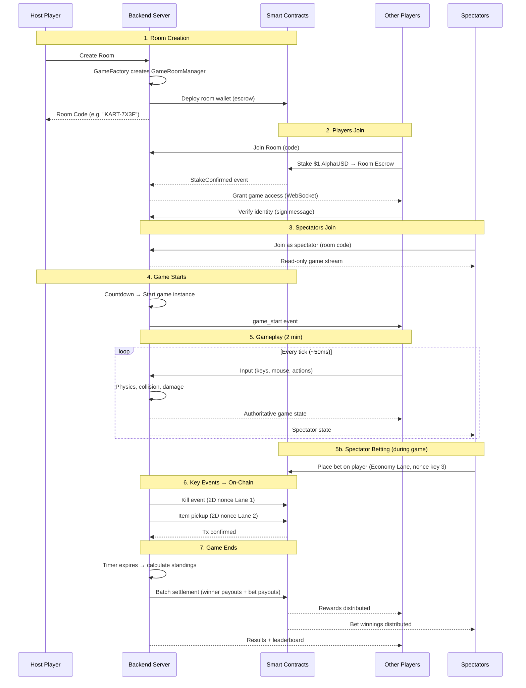

# TEMPO KARTS — Complete Game Context

> Master context file for the entire project. Feed this to any LLM to get full understanding.

---

## What Is This?

A **2D top-down multiplayer kart battle game** built on the **Tempo blockchain**. Think simplified Smash Karts with real stablecoin stakes, spectator betting (prediction market), and on-chain settlement. The core innovation is using **Tempo's 2D nonces** to create parallel "action lanes" so gameplay feels responsive despite being on-chain.

**Tech Stack:** Next.js + Phaser 3 + Socket.io + Tempo SDK (viem)

> [!IMPORTANT]
> **Privy is MANDATORY** (hackathon requirement). All auth goes through Privy.

---

## Team Split

| Person | Responsibility |
|--------|---------------|
| **@hyprayush** | Frontend: Next.js, Phaser game, Privy auth, UI/UX, spectator view |
| **Teammate** | Backend: Node.js server, Socket.io, smart contracts, Tempo chain integration, settlement |

**Shared:** Game design, architecture decisions, demo prep

**Repo:** <https://github.com/bismuth01/tempo-karts>

---

## Game Flow (High Level)



---

## Architecture Components

### 1. Smart Contracts (Tempo Chain)

```
GameFactory
├── createRoom() → deploys GameRoomManager
└── getRooms() → list active rooms

GameRoomManager (one per room)
├── Has its own wallet (escrow)
├── stake() → players deposit $1 AlphaUSD
├── settle(winners[], amounts[]) → distribute rewards
├── placeBet(playerId, amount) → spectator bets
├── close() → cleanup, return unclaimed funds
└── Events:
    ├── PlayerStaked(address, amount)
    ├── GameStarted(roomId, players[])
    ├── Kill(killer, victim, weapon, memo)
    ├── ItemPickup(player, item, memo)
    ├── BetPlaced(spectator, playerId, amount)
    ├── GameEnded(winner, standings[])
    └── RewardsDistributed(payouts[])
```

### 2. Backend Server (Node.js + Socket.io)

```
Server
├── GameFactory (creates room managers)
│   └── createRoom() → new GameRoomManager instance
│
├── GameRoomManager (per room)
│   ├── Room state (players, spectators, status)
│   ├── Game instance (physics, state, timer)
│   ├── WebSocket namespace (/room/:code)
│   ├── Wallet (for signing on-chain txs)
│   └── Methods:
│       ├── addPlayer(socket, wallet)
│       ├── addSpectator(socket)
│       ├── startGame()
│       ├── processInput(playerId, input)
│       ├── tick() → 20Hz game loop
│       ├── onKill(killer, victim) → emit on-chain
│       ├── endGame() → settle on-chain
│       └── close()
│
├── Matchmaking
│   └── Room codes, player caps, status tracking
│
└── Chain Integration
    ├── Tempo SDK (viem client)
    ├── 2D Nonce management (lanes 0-3)
    └── Fee sponsorship relay
```

### 3. Frontend (Next.js + Phaser 3)

See **Frontend Scenes** section below.

---

## Frontend Scenes (Phaser 3)

### Scene 1: LoadingScene

```
Purpose: Load all game assets with a progress bar
Visual: Dark background (#0a0a0f), "TEMPO KARTS" title in Press Start 2P font,
        neon progress bar filling up, maybe a spinning kart sprite
Assets loaded: kart sprite sheets, tilemap, weapons, particles, UI elements, sounds
Transitions to: MainMenuScene
```

### Scene 2: MainMenuScene

```
Purpose: Landing screen — create or join a room
Visual:
- Full-screen dark background with subtle animated particles
- "TEMPO KARTS" title at top, neon glow, maybe animated
- Animated kart sprite driving across bottom of screen (looping)
- Center panel with:
  - [CREATE ROOM] button → generates room code, shows waiting lobby
  - [JOIN ROOM] button → text input for room code → joins existing lobby
  - [SPECTATE] button → browse ongoing games list
- Bottom bar: player's wallet address (from Privy), balance
- Optional: settings icon, sound toggle, controls guide

State:
- After CREATE: shows lobby overlay with room code, player list, "START" button (host only)
- After JOIN: shows lobby overlay, waiting for host to start
- Player count indicator (e.g. "2/4 players")
- Staking happens here (frontend calls contract, backend confirms)
```

### Scene 3: GameScene (main gameplay)

```
Purpose: The actual kart battle
Visual:
- Tilemap arena (1600×1200 world, camera follows player)
- Player's kart (controlled via WASD/arrows)
- Other players' karts (positions from WebSocket server)
- Weapon pickups spawning on map
- Projectiles (missiles, bombs)
- Particle effects (explosions, trails, hit markers)
- HUD overlay:
  - Top-left: HP bar + player name
  - Top-right: Timer (countdown from 2:00)
  - Bottom: Item slot (current held item)
  - Kill feed (top-right corner, scrolling)
  - Mini-map (optional, bottom-right)

Input:
- WASD / Arrow keys: Move kart
- Mouse: Aim direction
- Left click: Fire weapon
- E key: Use item
- Tab: Scoreboard toggle

Game State Sync:
- Client sends input to server every frame
- Server sends authoritative state at 20Hz
- Client interpolates between server states for smooth rendering
- On-chain txs fire in background via 2D nonce lanes

Camera:
- Follows player kart with smooth lerp (0.1)
- Shake on damage taken
- Flash on kill
- Zoom: 1.2x
```

### Scene 4: ResultsScene (post-game)

```
Purpose: Show match results, leaderboard, payouts
Visual:
- Dark overlay over frozen game state
- Leaderboard popup (centered):
  - #1 🥇 PlayerName — 5 kills — $3.00 won
  - #2 🥈 PlayerName — 3 kills — $0.75 won
  - #3 🥉 PlayerName — 1 kill  — $0.25 won
  - #4    PlayerName — 0 kills — $0.00
- Each player's row shows:
  - Rank, kart color icon, name, kills, deaths, payout
- Winner has golden crown, confetti particles
- [VIEW ON EXPLORER] button → links to Tempo explorer tx
- [PLAY AGAIN] button → back to MainMenuScene
- [WATCH REPLAY] button → ReplayScene

Stablecoin Info:
- Total pot: $4.00
- Platform fee: $0.00 (hackathon)
- Distributed: $4.00
- Your payout: $X.XX
- Tx hash: 0x...
```

### Scene 5: ReplayScene

```
Purpose: Replay a completed game from on-chain event data
Visual: Same as GameScene but with:
- Playback controls (play, pause, speed 1x/2x/4x, scrub bar)
- All player movements reconstructed from events
- Kill highlights (camera zoom on kill moments)
- No input — pure spectator view

Data Source:
- Query GameRoomManager contract for all emitted events
- Reconstruct timeline from event timestamps + memos
- Events contain: positions, kills, items, all encoded in memos
```

---

## Prediction Market (Spectator Betting)

```
How it works:
1. Spectator joins an ongoing game room
2. Side panel shows all active players with:
   - Player name, kart color, current HP, kill count
   - Current odds (calculated from total bets on each player)
   - [BET] button with amount input
3. Spectator places bet → on-chain tx (Economy Lane, nonce key 3)
4. Bets lock when game timer reaches 30 seconds remaining
5. After game ends, winning bettors receive proportional share of bet pool

Bet Pool Distribution:
- Total bet pool = sum of all bets
- Winning pool = bets placed on the winning player
- Each winning bettor gets: (their bet / winning pool) × total pool
- Example: $10 total bets, $3 bet on winner → each $1 bet on winner pays $3.33

On-Chain:
- Each bet is a transfer to GameRoomManager with memo: "bet:playerId:amount"
- Settlement is a batch transaction distributing winnings
- All verifiable on Tempo Explorer
```

---

## 2D Nonce Action Lanes (The Innovation)

| Lane | Nonce Key | Who Sends | What |
| --- | --- | --- | --- |
| 🏎️ Drive | `0n` | Backend | Movement confirmations (sampled, not every frame) |
| 🔫 Combat | `1n` | Backend | Weapon fires, kills, damage events |
| 📦 Items | `2n` | Backend | Pickups, item usage |
| 💰 Economy | `3n` | Players/Spectators | Stakes, bets, payouts |

**Why this matters:** All 4 lanes execute in parallel. A bet being placed doesn't block a kill being recorded. A movement confirmation doesn't delay an item pickup. The game state stays responsive and the chain stays synchronized.

---

## Game Assets & Mechanics

### 1. Karts (The Player)

- **Theme:** Wooden Soapbox Derby style.
- **Views:** 8-Directional Sprites (45-degree increments):
  - Right, Down-Right, Down, Down-Left, Left, Up-Left, Up, Up-Right.
- **Size:** `48x48` pixels (Source), `32x32` Hitbox.
- **Customization:** Helmet color & racing stripes (8 Player Colors: Red, Blue, Green, Yellow, Purple, Orange, Cyan, Pink).

### 2. Weapons & Items

| Weapon | Type | Description | Visual (Retro Style) |
|--------|------|-------------|----------------------|
| **Rocket** | Projectile | Magic Missile / Bottle Rocket. | `32x16` px. Red/White rocket with sparkle trail. |
| **Timed Bomb** | Trap | Classic black round bomb. | `32x32` px. Sparking fuse. Flashes red. |
| **Invincible** | Buff | Star power / Magic Shield. | `48x48` px overlay. Golden pulse. |
| **Bullets** | Projectile | Dual magic bolts. | `16x8` px each. Glowing yellow capsules. |

### 3. Map Elements

- **Theme:** **"Village Circuit"** — Cobblestone roads, grass verges, wooden fences.
- **Tiles:** `32x32` pixels. Green grass, brown dirt track.
- **Walls:** Stone walls, hedges, or wooden barriers.
- **Borders:** Cliff edges dropping into a digital void / deep blue water.
- **Weapon Crates:**
  - **Visual:** Wooden Crate with glowing "?" mark. `32x32` px.
  - **Mechanic:** Pick up destroys crate, respawns after 10s.

---

## On-Chain Memo Encoding

Every on-chain action carries a 32-byte memo:

```
Byte 0:     Event type
              0x01 = player_join
              0x02 = fire_weapon
              0x03 = kill
              0x04 = item_pickup
              0x05 = item_use
              0x06 = bet_placed
              0x07 = game_end
              0x08 = position_snapshot
Bytes 1-2:  Room ID (uint16)
Bytes 3-4:  Source player ID (uint16)
Bytes 5-6:  Target player/item ID (uint16)
Byte 7:     Sub-type (weapon type, item type, etc.)
Bytes 8-11: Position X,Y (uint16 each)
Bytes 12-15: Extra data (damage, amount, etc.)
Bytes 16-31: Reserved / zero-padded
```

This encoding enables:

- Full game replay from chain data alone
- Verifiable kill records
- Transparent bet settlement
- Queryable game history

---
